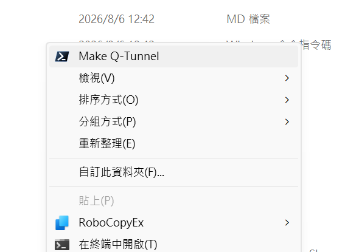

# Quick Tunnel Review Share

Create a temporary, filtered snapshot of a local folder and publish it through a
Cloudflare Quick Tunnel for short-lived code review. The source folder is never
served directly.

[繁體中文版本](README.zh-tw.md)


> Filter locally. Share deliberately. Review safely.

[](#requirements)
[](LICENSE)
[](docs/THREAT_MODEL.md#machine-readable-output)

---

## Table of Contents

- [Project Status](#project-status)
- [Requirements](#requirements)
- [Cloudflare / cloudflared Setup](#cloudflare--cloudflared-setup)
- [Authenticated Sharing Evaluation](#authenticated-sharing-evaluation)
- [Before You Share](#before-you-share)
- [Quick Start](#quick-start)
- [Usage](#usage)
  - [Windows](#windows)
  - [macOS](#macos)
- [Desktop Integration](#desktop-integration)
  - [Windows Explorer Context Menu](#windows-explorer-context-menu)
  - [macOS Finder Quick Action](#macos-finder-quick-action)
- [Machine-Readable Lifecycle](#machine-readable-lifecycle)
- [Safety Model](#safety-model)
- [Quick Tunnel Lifecycle](#quick-tunnel-lifecycle)
- [Developer Verification](#developer-verification)
- [Documentation](#documentation)
- [License](#license)

---

## Project Status

No tagged release exists yet. Until the first release, the latest commit on
`main` is the supported line. Confirm the exact revision and GitHub Actions
checks before publishing or sharing a release candidate.

---

## Requirements

| Component | Documented support | Enforced check | Tested evidence |
| --- | --- | --- | --- |
| Windows | PowerShell 7; Python 3.9+ | `#requires` and runtime Python check | PowerShell 7.6.3 and Python 3.14.6 on 2026-07-19 |
| macOS | macOS 14+ Homebrew path; Python 3.9+ | wrapper and Finder doctor check Python 3.9+ | macOS 15.7.7 x86_64 and Python 3.9.6 on 2026-07-19 |
| `cloudflared` | A release still inside Cloudflare's one-year support window | executable presence; Finder doctor also reports the version | 2026.6.1 in the macOS VM and 2026.7.1 on Windows |
| `qrencode` | Optional | no hard requirement | 4.1.1 in the macOS VM |

There is no invented numeric `cloudflared` minimum: Cloudflare publishes a
one-year release-support policy, while this project enforces only the CLI
capabilities it uses. Keep `cloudflared` updated within that support window.
The Finder path additionally requires built-in zsh, Terminal, Finder,
Automator, AppleScript, and `plutil`.

See the [macOS guide](macos/README.md) for Finder Quick Action installation,
feature parity, and verification.

---

## Cloudflare / cloudflared Setup

Quick Tunnel uses Cloudflare's `cloudflared` client to connect the local review
server to Cloudflare. The project uses **Quick Tunnels / TryCloudflare** by
default: `cloudflared` creates a random `*.trycloudflare.com` hostname and
forwards it to the local HTTP server. You do not need to add a domain to
Cloudflare DNS for this mode.

Official Cloudflare references:

- [`cloudflared` downloads and installation](https://developers.cloudflare.com/tunnel/downloads/)
- [Quick Tunnels / TryCloudflare](https://developers.cloudflare.com/cloudflare-one/networks/connectors/cloudflare-tunnel/do-more-with-tunnels/trycloudflare/)
- [Create a managed Cloudflare Tunnel](https://developers.cloudflare.com/tunnel/setup/)

### Install `cloudflared`

**Windows (PowerShell)**

The official Cloudflare download page provides both the Windows executable and
MSI installer. For a command-line install, Windows Package Manager can install
the published `Cloudflare.cloudflared` package:

```powershell
winget install --id Cloudflare.cloudflared --exact --source winget
cloudflared --version
```

If WinGet is unavailable or its package is behind the current Cloudflare
release, use the MSI/executable links on the official Cloudflare download page
above. Cloudflare notes that Windows `cloudflared` installations do not
automatically update.

**macOS**

```zsh
brew install cloudflared
cloudflared --version
```

Cloudflare documents Homebrew as the standard macOS installation path.

### Minimal manual Quick Tunnel test

If a local web server is already listening on port `8080`, the Cloudflare
documentation's minimal test is:

```text
cloudflared tunnel --url http://localhost:8080
```

`cloudflared` prints a temporary public `https://<random>.trycloudflare.com`
URL. Quick Tunnel is intended for testing and development; Cloudflare currently
limits it to 200 in-flight requests and does not support Server-Sent Events
(SSE). Quick Tunnel URLs are public unless the origin application adds its own
authentication layer.

---

## Authenticated Sharing Evaluation

The current Quick Tunnel workflow remains intentionally short-lived and
**unauthenticated**. A shared static password is not a native TryCloudflare
Quick Tunnel feature, so password-protected sharing should be treated as a
separate authentication layer rather than a tunnel flag.

| Mode | Cloudflare account / domain | Human authentication | Machine / agent authentication | Recommendation |
| --- | --- | --- | --- | --- |
| Existing Quick Tunnel | Not required | None | None | Keep as the zero-setup default for low-sensitivity, short-lived review |
| Quick Tunnel + local password gate | Not required | Shared password handled by the local review server | HTTP auth header/cookie if implemented | Possible compatibility mode when a literal shared password is required |
| Managed Tunnel + Cloudflare Access | Active Cloudflare domain required for a public hostname | Cloudflare account, IdP, or email One-Time PIN | Cloudflare Access service token | Recommended protected mode |

For a Cloudflare-native protected workflow, use a **managed Tunnel + Cloudflare
Access** in front of a self-hosted application. Access evaluates every request
before forwarding it to the origin and supports identity-provider login and
email One-Time PIN. Automated reviewers can use Access **service tokens**
(`CF-Access-Client-Id` and `CF-Access-Client-Secret`) instead of an interactive
login.

Official references:

- [Publish a self-hosted application with Cloudflare Access](https://developers.cloudflare.com/cloudflare-one/access-controls/applications/http-apps/self-hosted-public-app/)
- [One-Time PIN login](https://developers.cloudflare.com/cloudflare-one/integrations/identity-providers/one-time-pin/)
- [Service tokens](https://developers.cloudflare.com/cloudflare-one/access-controls/service-credentials/service-tokens/)
- [Authenticate coding agents](https://developers.cloudflare.com/cloudflare-one/access-controls/authenticate-agents/)

**Implementation recommendation:** retain Quick Tunnel as the default and add a
future explicit authentication mode, for example `Quick`, `Password`, or
`Access`. `Password` should be enforced by the local safe server without
putting the password in command-line arguments, logs, JSON events, or the public
URL. `Access` should use a named/managed tunnel and Cloudflare Access policies;
service-token secrets should likewise remain outside project output and staged
review content.

---

## Before You Share

> [!WARNING]
> Quick Tunnel endpoints are **unauthenticated and temporary**. Anyone who
> obtains the generated URL can access the filtered snapshot while the process
> is live. Do not use this project for credentials, regulated data, or other
> high-sensitivity material.

Before opening a public tunnel:

1. Inspect the selected folder carefully.
2. Run `-ValidateOnly` to verify the filtered snapshot locally.
3. Add project-specific exclusions with `-AdditionalExclude`.
4. Use `-Yes` only inside an already approved workflow.

Use the [sharing and filtering matrix](docs/SHARING_MATRIX.md) to understand
what the default filter does—and does not—protect.

---

## Quick Start

**Windows** — share a folder for 30 minutes:

```powershell
.\share-codex-review.ps1 "D:\Projects\MyProject"
```

**macOS** — share a folder for 30 minutes:

```zsh
python3 ./macos/share-codex-review.py "/path/to/MyProject"
```

Validate locally without opening a public tunnel:

```powershell
# Windows
.\share-codex-review.ps1 "D:\Projects\MyProject" -ValidateOnly
```

```zsh
# macOS
python3 ./macos/share-codex-review.py "/path/to/MyProject" --validate-only
```

---

## Usage

### Windows

The default public lifetime is 30 minutes. Change it with `-DurationMinutes`,
or press **Enter** to stop early.

| Purpose | Option |
| --- | --- |
| Change lifetime | `-DurationMinutes 10` |
| Select a local port | `-Port 8080` |
| Limit copied file size | `-MaxFileSizeMB 25` |
| Add a wildcard exclusion | `-AdditionalExclude "private/*"` |
| Disable QR output | `-NoQrCode` |
| Skip the `SHARE` prompt | `-Yes` |
| Change retry count | `-QuickTunnelAttempts 3` |
| Change retry base delay | `-QuickTunnelRetryBaseSeconds 5` |
| Emit versioned NDJSON | `-Json` |

> [!CAUTION]
> `-Yes` creates an unauthenticated public endpoint without the interactive
> confirmation. Use it only inside an already approved workflow.

### macOS

```zsh
python3 ./macos/share-codex-review.py "/path/to/MyProject"
```

Validate only (no public tunnel):

```zsh
python3 ./macos/share-codex-review.py "/path/to/MyProject" --validate-only
```

<p align="center">
  
</p>

---

## Desktop Integration

### Windows Explorer Context Menu

Double-click `context-menu-setup.cmd`, choose **Install**, and type `INSTALL`.
The command is installed for the current Windows user only. On Windows 11 it
may appear under **Show more options**. The installed entry is labelled
**Make Q-Tunnel**.



To remove:

```powershell
.\manage-context-menu.ps1 -Action Uninstall
```

### macOS Finder Quick Action

Install the per-user Finder Quick Action:

```zsh
/bin/zsh ./macos/manage-finder-quick-action.sh install
```

Run the non-mutating compatibility and version check first, or choose
**Run doctor** from `finder-quick-action-setup.command`:

```zsh
/bin/zsh ./macos/manage-finder-quick-action.sh doctor
```

Select one folder in Finder, then choose **Quick Actions > Make Q-Tunnel**.
Removal is recoverable: installed files are moved into sibling `.del` folders
instead of being permanently erased.

---

## Machine-Readable Lifecycle

Use `-Json` on Windows or `--json` on macOS for versioned NDJSON lifecycle
events.

| Mode | Events emitted |
| --- | --- |
| Validate-only | `validated`, `cleanup` |
| Public mode | `public_ready` (while URL is live), `cleanup` |
| Error | `error` (nonzero exit code) |

JSON public mode requires `-Yes` or `--yes` so stdout cannot block on a prompt.

**Version 1 fields:** `schema_version`, `event`, `mode`, `public_url`,
`expires_at`, `server_pid`, `tunnel_pid`, `staging_root`, `error`.

The explicit JSON option permits disclosure of the local `staging_root`; do not
forward that field unnecessarily. See the
[Agent integration contract](docs/AGENT_INTEGRATION.md).

---

## Safety Model

- Copies permitted files into an isolated temporary staging directory.
- Excludes common dependency, VCS, environment, credential, and key paths.
- Blocks high-signal secret formats before opening the tunnel.
- Skips reparse points and files above the configured size limit.
- Serves source-controlled HTML, SVG, scripts, and markup as inert plain text.
- Adds restrictive browser security headers and disables caching.
- Binds the local origin to `127.0.0.1` only.
- Requires explicit `SHARE` confirmation unless `-Yes` is supplied.
- Stops the local server and tunnel and removes staging files on exit.

**Limitations:** The secret scan is intentionally conservative and cannot
guarantee that every credential or private datum has been detected. It scans
only configured text extensions whose staged size is at most 2 MiB; larger or
unknown-format files may still be copied when they are under the separate
copy-size limit. Remote inert rendering also does not make a downloaded file
safe to execute.

Cleanup is guaranteed for normal exit and handled failures. Force-killing the
process, terminating the host, or an operating-system crash can leave temporary
files behind. Follow the [threat model](docs/THREAT_MODEL.md) for recovery and
residual-risk guidance.

---

## Quick Tunnel Lifecycle

The Quick Tunnel is created only after local validation and explicit approval.
The terminal displays the public URL, process IDs, verification result, and
scheduled expiration time. When the lifetime expires, the tunnel is stopped and
temporary files are removed. Context-menu launches keep the completion message
visible until acknowledged.

Transient Cloudflare-side `500/1101` Quick Tunnel creation failures are retried
up to three times with exponential backoff; configuration errors and rate-limit
responses are not retried.

<p align="center">
  
</p>

> [!NOTE]
> Cloudflare Quick Tunnels are unauthenticated, temporary development endpoints.
> Anyone with the generated URL can access the filtered snapshot while the
> process is running.

---

## Developer Verification

**Windows:**

```powershell
./windows/tests/test-share-codex-review.ps1
python -m unittest discover -s tests -v
```

**macOS:**

```zsh
PYTHONDONTWRITEBYTECODE=1 python3 -m unittest discover -s macos/tests -v
PYTHONDONTWRITEBYTECODE=1 python3 -m unittest discover -s tests -v
```

GitHub Actions runs the Windows suite, macOS Python and native syntax checks,
shared safe-server tests, and a Python 3.14 compatibility job. CI never opens a
public tunnel or installs desktop integrations.

---

## Documentation

| Resource | Link |
| --- | --- |
| Documentation index | [docs/README.md](docs/README.md) |
| Threat model | [docs/THREAT_MODEL.md](docs/THREAT_MODEL.md) |
| Sharing and filtering matrix | [docs/SHARING_MATRIX.md](docs/SHARING_MATRIX.md) |
| Agent integration contract | [docs/AGENT_INTEGRATION.md](docs/AGENT_INTEGRATION.md) |
| macOS guide | [macos/README.md](macos/README.md) |
| Security policy | [SECURITY.md](SECURITY.md) |
| Contributing guide | [CONTRIBUTING.md](CONTRIBUTING.md) |
| Changelog | [CHANGELOG.md](CHANGELOG.md) |

---

## License

Quick Tunnel Review Share is licensed under the
[MIT License](LICENSE) (`SPDX-License-Identifier: MIT`).
